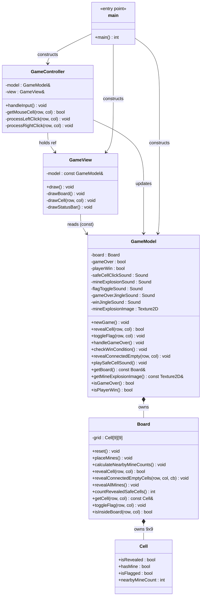

# 💣 MINESWEEPER — MVC ARCHITECTURE REFACTOR

> **A C++ Minesweeper game refactored from SOLID principles into a full MVC architecture — Built with Raylib**
>
> **Course:** University Assignment 3 &nbsp;|&nbsp; **CLO:** CLO4 &nbsp;|&nbsp; **Focus:** MVC Design Pattern + SOLID Principles

---

## 📑 Table of Contents

1. [Project Overview](#-project-overview)
2. [MVC Architecture Explained](#-mvc-architecture-explained)
3. [How MVC Improves the SOLID Design](#-how-mvc-improves-the-solid-design)
4. [Project Structure](#-project-structure)
5. [Class Responsibilities](#-class-responsibilities)
6. [UML Class Diagram](#️-uml-class-diagram)
7. [Data Flow Diagram](#-data-flow-diagram)
8. [SOLID Principles Preserved](#-solid-principles-preserved)
9. [How to Build](#️-how-to-build)
10. [How to Run](#-how-to-run)
11. [Controls](#-controls)

---

## 📖 Project Overview

This project is a fully working 9×9 Minesweeper game built with C++ and the Raylib graphics library. It was originally written in C, then refactored into C++ following SOLID OOP principles, and has now been further reorganised into a clean **MVC (Model–View–Controller)** architecture for this final submission.

All existing gameplay features are preserved:

| Feature | Status |
|---|---|
| Mine placement (random, seeded) | ✅ Unchanged |
| Cell reveal (left-click) | ✅ Unchanged |
| Flood-fill of empty areas | ✅ Unchanged |
| Flag placement (right-click) | ✅ Unchanged |
| Win condition detection | ✅ Unchanged |
| Lose condition (mine hit) | ✅ Unchanged |
| Audio playback (5 sounds) | ✅ Unchanged |
| Explosion image on mine cells | ✅ Unchanged |
| Checkerboard visual style | ✅ Unchanged |

---

## 🏛️ MVC Architecture Explained

MVC divides an application into three interconnected layers, each with a single, clear responsibility.

### MODEL — The Data & Logic Brain

The Model is the **single source of truth** for the game. It owns all data and knows all rules. It has zero knowledge of how the game looks or what the player pressed.

**In this project the Model consists of two classes:**

**`Board`** — the pure game-data class:
- Owns the 9×9 grid of `Cell` structs.
- Places mines, calculates neighbour counts, reveals cells, performs flood-fill, and counts safe cells for the win check.
- Has **no dependency on Raylib** whatsoever. It is the most isolated class in the project.

**`GameModel`** — the session manager:
- Owns the `Board` plus all audio assets (`Sound`, `Texture2D`).
- Manages high-level state flags: `gameOver`, `playerWin`, and three play-once sound guards.
- Exposes a clean API of named methods (`revealCell`, `toggleFlag`, `handleGameOver`, `checkWinCondition`, etc.) that the Controller calls.
- Provides read-only accessors (`getBoard()`, `isGameOver()`, `isPlayerWin()`) that the View calls.

> ⚠️ **Why does audio live in the Model?**
> Audio is a *game-state side-effect*: a mine exploding causes a boom sound; winning causes a jingle. The Model owns these events and fires them when the state changes. Keeping audio in the Model means neither the Controller nor the View ever touches sound state — the Model is the only class that knows "has the explosion sound already played?" This preserves clean separation. The View only renders pixels; the Controller only wires inputs.

---

### VIEW — The Renderer

The View is responsible for **all visual output**. Every single `Draw*` function call in the entire project is inside `GameView`.

**`GameView`** — the renderer:
- Holds a **const reference** to `GameModel`. It can read state but cannot change it.
- Implements three private drawing helpers: `drawCell()`, `drawBoard()`, `drawStatusBar()`.
- All colour constants are declared here as `static constexpr Color`.
- Contains **no game logic** and **no input handling** whatsoever.

---

### CONTROLLER — The Input Wrangler

The Controller reads raw hardware input and translates it into Model method calls. It is the wiring between the player and the game logic.

**`GameController`** — the input handler:
- Holds references to both `GameModel` and `GameView`.
- `handleInput()` is called once per frame. It reads Raylib mouse state and decides what Model method to call.
- Converts mouse pixel coordinates to board `(row, col)` indices.
- Contains **zero rendering logic** and **zero game data**.

---

## 📈 How MVC Improves the SOLID Design

The previous SOLID submission already had good separation of concerns, but the responsibilities were distributed unevenly:

| What changed | SOLID design (before) | MVC design (after) |
|---|---|---|
| **Drawing code** | All in `main.cpp` as free functions | Encapsulated in `GameView` class |
| **Input handling** | In `Game::update()` — mixed with state | In `GameController` — input only |
| **State + audio** | In `Game` — a single large class | Split: `GameModel` (state + audio) |
| **Board logic** | In `Board` — good, unchanged | In `Board` — unchanged |
| **Entry point** | `main()` orchestrated drawing + logic | `main()` constructs MVC triple, runs loop |
| **Testability** | `Game::update()` mixes input + state | Model is fully testable without UI |
| **Extensibility** | Adding a menu required editing `main.cpp` | Adding a menu means adding a `GameView` method |

The MVC refactor makes the architecture **academically formal**: any team member can work on View, Model, or Controller independently without touching the other layers.

---

## 📁 Project Structure

```
minesweeper-MVC/
│
├── src/
│   │
│   ├── model/                   ← MODEL LAYER
│   │   ├── Board.h              │  Pure game data: Cell struct + grid operations
│   │   ├── Board.cpp            │  Mine placement, reveal, flood-fill, win-count
│   │   ├── GameModel.h          │  Session state: gameOver, playerWin, audio
│   │   └── GameModel.cpp        │  State transitions + audio side-effects
│   │
│   ├── view/                    ← VIEW LAYER
│   │   ├── GameView.h           │  Declaration of all rendering methods
│   │   └── GameView.cpp         │  ALL Raylib Draw* calls live here exclusively
│   │
│   ├── controller/              ← CONTROLLER LAYER
│   │   ├── GameController.h     │  Declaration of input handling
│   │   └── GameController.cpp   │  Mouse input → Model method calls
│   │
│   └── main.cpp                 ← ENTRY POINT
│                                   Constructs MVC triple, runs game loop
│
├── sounds/                      ← Audio assets (unchanged)
│   ├── number.mp3
│   ├── boom.mp3
│   ├── flag.mp3
│   ├── over.mp3
│   └── win.mp3
│
├── images/                      ← Visual assets (unchanged)
│   └── boomm.png
│
├── build/                       ← Compiled binary output (git-ignored)
│   └── .gitkeep
│
├── docs/
│   └── CPP_Documentation.md
│
├── Makefile                     ← Updated for MVC source paths
└── README.md                    ← This file
```

---

## 📋 Class Responsibilities

### `Cell` (struct, `model/Board.h`)
Plain data struct. Four boolean/int fields. No methods.

| Field | Type | Meaning |
|---|---|---|
| `isRevealed` | `bool` | Player has opened this cell |
| `hasMine` | `bool` | A mine is hiding here |
| `isFlagged` | `bool` | Player has placed a flag |
| `nearbyMineCount` | `int` | Count of mines in 8 neighbours |

### `Board` (class, MODEL)
Manages the 9×9 grid. No Raylib dependency.

| Method | Role |
|---|---|
| `reset()` | Clear all cells to defaults |
| `placeMines()` | Randomly scatter TOTAL_MINES mines |
| `calculateNearbyMineCounts()` | Precompute all neighbour counts |
| `revealCell(row, col)` | Open one cell; returns `true` on mine |
| `revealConnectedEmptyCells(row, col, cb)` | Flood-fill empty region with callback |
| `revealAllMines()` | Expose all mines on game-over |
| `countRevealedSafeCells()` | Count for win-condition check |
| `getCell(row, col)` | Read-only cell access (for View) |
| `toggleFlag(row, col)` | Place/remove flag |
| `isInsideBoard(row, col)` | Bounds guard (static) |

### `GameModel` (class, MODEL)
Session owner. Wraps Board, owns audio, manages state.

| Method | Caller | Role |
|---|---|---|
| `newGame()` | Controller | Reset all state + board |
| `revealCell(row, col)` | Controller | Delegate to Board |
| `toggleFlag(row, col)` | Controller | Delegate + play flag sound |
| `handleGameOver()` | Controller | Reveal all mines + play sounds |
| `checkWinCondition()` | Controller | Set playerWin + play win sound |
| `revealConnectedEmpty(row, col)` | Controller | Flood-fill with sound callback |
| `playSafeCellSound()` | Controller + callback | Play click sound |
| `getBoard()` | View + Controller | Read-only board access |
| `getMineExplosionImage()` | View | Texture for mine cells |
| `isGameOver()` | View + Controller | Read state flag |
| `isPlayerWin()` | View + Controller | Read state flag |

### `GameView` (class, VIEW)
The sole renderer. All `Draw*` calls live here.

| Method | Role |
|---|---|
| `draw()` | Called each frame; clears + draws board + status |
| `drawBoard()` | Iterates all cells and calls drawCell |
| `drawCell(row, col)` | Renders one cell (background, border, content) |
| `drawStatusBar()` | Renders the bottom message strip |

### `GameController` (class, CONTROLLER)
Translates input into Model calls.

| Method | Role |
|---|---|
| `handleInput()` | Called each frame; reads mouse, calls Model |
| `getMouseCell(row, col)` | Pixels → board indices |
| `processLeftClick(row, col)` | Reveal cell; handle mine or flood-fill |
| `processRightClick(row, col)` | Toggle flag via Model |

---

## 🗺️ UML Class Diagram



---

## 🔄 Data Flow Diagram

```
  ┌─────────────────────────────────────────────────────────────┐
  │                        GAME LOOP (main.cpp)                  │
  │                                                               │
  │   1. controller.handleInput()   ──►  reads Raylib mouse      │
  │   2. view.draw()                ──►  reads Model, draws       │
  └─────────────────────────────────────────────────────────────┘
                │                              │
                ▼                              ▼
  ┌─────────────────────────┐    ┌─────────────────────────────┐
  │     CONTROLLER          │    │          VIEW               │
  │  GameController         │    │       GameView              │
  │                         │    │                             │
  │  getMouseCell() ──►     │    │  draw()                     │
  │    pixel → (row,col)    │    │    ClearBackground()        │
  │                         │    │    drawBoard()              │
  │  processLeftClick()     │    │      DrawRectangleRec()     │
  │    model.revealCell()   │    │      DrawTexturePro()       │
  │    model.handleGameOver │    │      DrawText()             │
  │    model.revealConnected│    │      DrawTriangle()         │
  │                         │    │    drawStatusBar()          │
  │  processRightClick()    │    │      DrawText()             │
  │    model.toggleFlag()   │    └─────────────────────────────┘
  │                         │                 ▲
  │  model.checkWinCond()   │                 │ const read
  └────────────┬────────────┘                 │
               │ mutates                      │
               ▼                              │
  ┌─────────────────────────────────────────────────────────────┐
  │                         MODEL                                │
  │                                                              │
  │  GameModel                          Board                    │
  │  ─────────────────────              ───────────────────────  │
  │  gameOver : bool          owns ──►  grid[9][9] : Cell        │
  │  playerWin : bool                   placeMines()             │
  │  Sound assets                       revealCell()             │
  │  Texture2D asset                    revealConnectedEmpty()   │
  │  newGame()                          toggleFlag()             │
  │  revealCell()     ──────────────►   countRevealedSafe()      │
  │  handleGameOver()                   revealAllMines()         │
  │  checkWinCondition()                getCell() ◄── View       │
  │  playSafeCellSound()                                         │
  └─────────────────────────────────────────────────────────────┘
```

---

## 🧱 SOLID Principles Preserved

MVC does not replace SOLID — it extends it by imposing a structural pattern. All five SOLID principles remain active:

| Principle | How it is maintained in the MVC design |
|---|---|
| **SRP** | Each class has exactly one reason to change. `Board` changes if grid logic changes. `GameView` changes if visuals change. `GameController` changes if input handling changes. |
| **OCP** | Adding a difficulty selector extends `GameModel` with new constants and `GameView` with a new menu method — neither existing class is modified. |
| **LSP** | Not applicable (no inheritance hierarchy), but composition is used correctly: `GameModel` owns `Board`; `GameView` holds a const-ref to `GameModel`. |
| **ISP** | `GameView` only calls read-only accessors on `GameModel`. `GameController` only calls mutating methods. Neither layer is forced to depend on methods it doesn't use. |
| **DIP** | `Board` depends on an abstract function-pointer callback for sound, not on Raylib directly. `GameController` depends on `GameModel`'s public interface, not its internal fields. |

---

## 🛠️ How to Build

### Prerequisites
- **Raylib** installed (version 5.0+ recommended).
- **g++** with C++17 support (MinGW on Windows, GCC on Linux).

### Linux (Recommended for University Evaluation)

```bash
# From the project root directory:
g++ -std=c++17 \
    src/main.cpp \
    src/model/Board.cpp \
    src/model/GameModel.cpp \
    src/view/GameView.cpp \
    src/controller/GameController.cpp \
    -lraylib -lGL -lm -lpthread -ldl -lrt -lX11 \
    -o build/minesweeper
```

Or using the Makefile:

```bash
make
```

### Windows (VS Code / MinGW Terminal)

```bash
# From the project root directory:
g++ -std=c++17 ^
    src/main.cpp ^
    src/model/Board.cpp ^
    src/model/GameModel.cpp ^
    src/view/GameView.cpp ^
    src/controller/GameController.cpp ^
    -IC:\raylib\include -LC:\raylib\lib ^
    -lraylib -lopengl32 -lgdi32 -lwinmm ^
    -o build/minesweeper.exe
```

Or using the Makefile:

```bash
mingw32-make
```

---

## ▶️ How to Run

> ⚠️ **Always run from the project root.** The game loads `sounds/` and `images/` using relative paths.

```bash
# Linux
./build/minesweeper

# Windows
.\build\minesweeper.exe
```

---

## 🎮 Controls

| Action | Input |
|---|---|
| Reveal a cell | Left mouse button |
| Place / remove a flag | Right mouse button |
| (No restart key — close and rerun to play again) | — |

---

## 🤖 AI Prompt

> *"Refactor the existing C++ SOLID Minesweeper project into a full MVC architecture. Separate the project into Model (Board.h, Board.cpp, GameModel.h, GameModel.cpp), View (GameView.h, GameView.cpp), and Controller (GameController.h, GameController.cpp). The Model must have no rendering code. All Raylib Draw* calls must be in the View only. The Controller handles all user input and coordinates Model and View. Preserve all existing functionality: mine placement, cell reveal, flood-fill, flagging, win/lose conditions, and audio playback. Update the Makefile and README to reflect the new MVC structure."*
