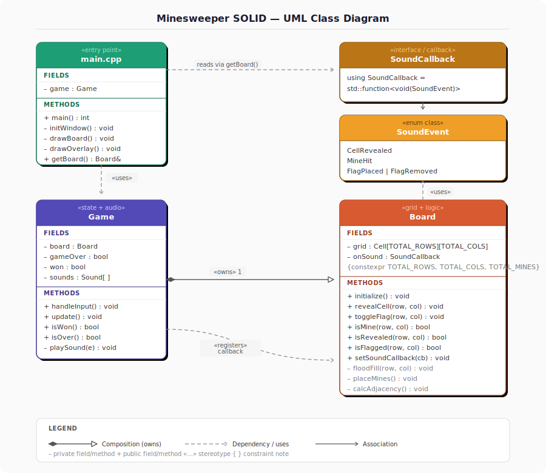

# 💣 MINESWEEPER — SOLID OOD REFACTOR

> **A C++ Object-Oriented Refactor of a C Minesweeper Game — Built with Raylib**
>
> **Course:** University Assignment 2 &nbsp;|&nbsp; **CLO:** CLO4 &nbsp;|&nbsp; **Focus:** SOLID Design Principles

---

## 📑 Table of Contents

1. [Project Overview](#-project-overview)
2. [Branch Strategy](#-branch-strategy)
3. [Project Structure](#-project-structure)
4. [SOLID Principles Applied](#-solid-principles-applied)
   - [Single Responsibility Principle](#s--single-responsibility-principle)
   - [Open/Closed Principle](#o--openclosed-principle)
   - [Liskov Substitution Principle](#l--liskov-substitution-principle)
   - [Interface Segregation Principle](#i--interface-segregation-principle)
   - [Dependency Inversion Principle](#d--dependency-inversion-principle)
5. [Architecture](#️-architecture)
6. [Module Breakdown](#-module-breakdown)
7. [How to Build](#️-how-to-build)
8. [How to Run](#-how-to-run)
9. [Controls](#-controls)
10. [AI Prompt](#-ai-prompt)

---


## 🗺️ UML Class Diagram



---

## 🎯 Project Overview

**Minesweeper SOLID** is a C++ refactor of an original C implementation of the classic Minesweeper game, rendered in real-time using the Raylib graphics library. The core gameplay — revealing cells, flagging mines, and flood-fill expansion — is preserved exactly. The purpose of the refactor is to restructure the codebase so that every one of the five SOLID object-oriented design principles is demonstrably and intentionally applied.

The project is split across two branches to make the before/after transformation clear:

| Branch | Folder | Description |
|---|---|---|
| `main` | Root | Base project structure, assets, and build configuration |
| `solid-refactor` | `src/` | Fully refactored C++ source — all five SOLID principles applied |

The refactored version separates the codebase into three clearly bounded responsibilities: `Board` owns the grid and mine logic, `Game` owns state and audio, and `main.cpp` owns the rendering and game loop. A function-pointer callback mechanism decouples `Board` from Raylib entirely.

---

## 🌿 Branch Strategy

| Branch | Purpose |
|---|---|
| `main` | Base project structure |
| `solid-refactor` | SOLID refactored C++ source code |

---

## 📁 Project Structure

```
minesweeper-solid/
│
├── README.md                        ← You are here
│
├── src/                             ← All C++ source & header files
│   ├── main.cpp                     ← Entry point, window, game loop, drawing
│   ├── Board.h                      ← Board class declaration
│   ├── Board.cpp                    ← Board logic (mines, reveal, flood-fill)
│   ├── Game.h                       ← Game class declaration
│   └── Game.cpp                     ← Game state, input handling, audio
│
├── sounds/                          ← All audio assets
│   ├── boom.mp3                     ← Mine explosion sound
│   ├── flag.mp3                     ← Flag toggle sound
│   ├── number.mp3                   ← Safe cell click sound
│   ├── over.mp3                     ← Game over jingle
│   └── win.mp3                      ← Win jingle
│
├── images/                          ← All image assets
│   └── boomm.png                    ← Explosion image drawn on mine cells
│
├── docs/                            ← Documentation
│   ├── CPP_Documentation.md         ← Full code documentation
│   └── uml_diagram.svg              ← UML class diagram
│
├── resources/                       ← Licenses & third-party resources
│   └── LICENSE
│
├── build/                           ← Compiled output (git-ignored)
│
├── .gitignore
├── Makefile                         ← Linux / Mac build
└── Makefile.Android                 ← Android build
```

---

## 🧱 SOLID Principles Applied

The table below gives a quick mapping of each principle to its location. Detailed explanations follow.

| Principle | Where Applied |
|---|---|
| **S** — Single Responsibility | `Board` handles grid only. `Game` handles state & audio only. `main.cpp` handles drawing only. |
| **O** — Open/Closed | Board constants (`TOTAL_ROWS`, `TOTAL_COLS`, `TOTAL_MINES`) are `constexpr` — extend without modifying logic. |
| **L** — Liskov Substitution | No inheritance used — composition preferred (`Game` owns `Board`). |
| **I** — Interface Segregation | Only methods needed by `main.cpp` are public on `Game` and `Board`. |
| **D** — Dependency Inversion | `Board` uses a function pointer callback for sound — no dependency on Raylib or `Game`. |

---

### S — Single Responsibility Principle

Each file and class is responsible for exactly one concern. No class mixes rendering with logic, or audio with grid management.

| Class / File | Its Single Responsibility |
|---|---|
| `Board.h` / `Board.cpp` | Grid data, mine placement, cell reveal, flood-fill. Nothing else. |
| `Game.h` / `Game.cpp` | Game state machine, input handling, audio playback. Nothing else. |
| `main.cpp` | Window creation, game loop timing, all Raylib draw calls. Nothing else. |

Before the refactor, all of these concerns were interleaved in a single file. If you needed to change how audio was triggered, you were editing the same file that managed mine placement. Now each responsibility lives in isolation — a change to rendering never touches `Board`, and a change to mine logic never touches audio.

---

### O — Open/Closed Principle

The board's configuration values are declared as `constexpr` constants at the top of `Board.h`:

```cpp
constexpr int TOTAL_ROWS  = 16;
constexpr int TOTAL_COLS  = 16;
constexpr int TOTAL_MINES = 40;
```

To create a new difficulty level — easy (9×9, 10 mines) or expert (30×16, 99 mines) — you change only these three constants. No conditional branches, no modification to `Board::placeMines()`, `Board::revealCell()`, or the flood-fill logic. The board is **open for extension** (new grid sizes, new mine counts) and **closed for modification** (core algorithms are untouched).

---

### L — Liskov Substitution Principle

No inheritance hierarchy is present in this project. This is deliberate. The L principle was addressed by choosing **composition over inheritance**: `Game` owns a `Board` instance directly as a member, rather than inheriting from it.

```cpp
// Game.h
class Game {
private:
    Board board;   // composition — Game uses Board, does not extend it
    ...
};
```

This means there are no subclass/superclass relationships that could be violated. Any future extension — such as a `TimedGame` variant — would similarly compose `Game` rather than inherit from it, keeping the substitution guarantee trivially satisfied.

---

### I — Interface Segregation Principle

The public APIs of `Board` and `Game` are minimal. Only the methods that `main.cpp` actually calls are exposed as `public`. Internal helpers used solely within a class are `private`.

**`Board` public interface (used by `main.cpp`):**

```cpp
void    initialize();
void    revealCell(int row, int col);
void    toggleFlag(int row, int col);
bool    isMine(int row, int col) const;
bool    isRevealed(int row, int col) const;
bool    isFlagged(int row, int col) const;
int     getAdjacentMines(int row, int col) const;
```

**`Game` public interface (used by `main.cpp`):**

```cpp
void    handleInput();
void    update();
bool    isWon()  const;
bool    isOver() const;
Board&  getBoard();
```

`main.cpp` is never forced to call methods it does not need. This keeps the rendering loop lightweight and decoupled from any internal state transitions inside `Game`.

---

### D — Dependency Inversion Principle

The most structurally significant SOLID decision in this project: `Board` must trigger a sound when a cell is revealed, but `Board` has no dependency on Raylib or on `Game`. This was solved using a **function pointer callback**.

`Board` declares a callback type and stores it as a member:

```cpp
// Board.h
using SoundCallback = std::function<void(SoundEvent)>;

class Board {
public:
    void setSoundCallback(SoundCallback cb);
private:
    SoundCallback onSound;
};
```

`Game` registers itself as the sound handler at startup:

```cpp
// Game.cpp
board.setSoundCallback([this](SoundEvent e) {
    this->playSound(e);
});
```

When `Board` needs to signal a sound event, it calls `onSound(SoundEvent::CellRevealed)` — it has no knowledge of Raylib, `PlaySound()`, or `Game`. The high-level `Game` module provides the concrete implementation; the low-level `Board` module depends only on the abstraction (the callback interface). This is the Dependency Inversion Principle applied correctly: both modules depend on the abstraction, not on each other.

---

## 🏛️ Architecture

```
╔══════════════════════════════════════════════════════════════╗
║                    Presentation Layer                        ║
║                                                              ║
║   ┌──────────────────────────────────────────────────────┐  ║
║   │                     main.cpp                          │  ║
║   │                                                        │  ║
║   │  InitWindow()   — Raylib window setup                 │  ║
║   │  Game loop      — BeginDrawing / EndDrawing           │  ║
║   │  Draw cells     — reads Board via Game::getBoard()    │  ║
║   │  Draw UI        — win/lose overlay, flag counter      │  ║
║   └──────────────────────────┬─────────────────────────┘   ║
╚═════════════════════════════╪════════════════════════════════╝
                              │
                              ▼
╔══════════════════════════════════════════════════════════════╗
║                     State / Audio Layer                      ║
║                                                              ║
║   ┌──────────────────────────────────────────────────────┐  ║
║   │                     Game.cpp                          │  ║
║   │                                                        │  ║
║   │  handleInput()  — mouse click → Board calls           │  ║
║   │  update()       — win/loss condition checks           │  ║
║   │  playSound()    — registered as Board's callback      │  ║
║   │  isWon()        — expose state to main.cpp            │  ║
║   └──────────────────────────┬─────────────────────────┘   ║
╚═════════════════════════════╪════════════════════════════════╝
                              │  (callback only — no direct dep)
                              ▼
╔══════════════════════════════════════════════════════════════╗
║                      Grid / Logic Layer                      ║
║                                                              ║
║   ┌──────────────────────────────────────────────────────┐  ║
║   │                     Board.cpp                         │  ║
║   │                                                        │  ║
║   │  placeMines()   — random mine placement               │  ║
║   │  revealCell()   — single cell reveal                  │  ║
║   │  floodFill()    — recursive blank expansion           │  ║
║   │  toggleFlag()   — flag state toggle                   │  ║
║   │  [no Raylib, no audio — pure grid logic]              │  ║
║   └──────────────────────────────────────────────────────┘  ║
╚══════════════════════════════════════════════════════════════╝
```

Zero circular dependencies. `Board` knows nothing about `Game` or `main.cpp`. `Game` knows `Board` but not `main.cpp`. `main.cpp` knows both but only through their public interfaces.

---

## 📦 Module Breakdown

### `Board.h` / `Board.cpp`

The grid engine. Owns the 2D cell array, mine positions, reveal state, flag state, and adjacency counts. Exposes a minimal public interface for querying and mutating cell state. Has no knowledge of Raylib, audio, or game-over conditions. Sound events are emitted through the registered `SoundCallback` only.

Key methods:

| Method | Responsibility |
|---|---|
| `initialize()` | Reset grid, place mines, calculate adjacency counts |
| `revealCell(row, col)` | Reveal one cell; trigger flood-fill on blanks; fire sound callback |
| `toggleFlag(row, col)` | Place or remove a flag on an unrevealed cell |
| `isMine / isRevealed / isFlagged` | Read-only state queries for the renderer |
| `getAdjacentMines(row, col)` | Return the precomputed adjacent mine count |

---

### `Game.h` / `Game.cpp`

The state and audio manager. Owns a `Board` instance and all loaded Raylib `Sound` handles. Registers itself as `Board`'s sound callback during construction. Translates mouse input into `Board` calls. Tracks win/loss conditions.

Key methods:

| Method | Responsibility |
|---|---|
| `handleInput()` | Poll mouse; route left-click to `revealCell`, right-click to `toggleFlag` |
| `update()` | Check win condition (all non-mine cells revealed) |
| `playSound(SoundEvent)` | Switch on event type; call the appropriate `PlaySound()` |
| `isWon() / isOver()` | Expose state booleans to `main.cpp` |
| `getBoard()` | Return a reference to the `Board` for the renderer |

---

### `main.cpp`

The presentation entry point. Initialises the Raylib window and audio device, constructs a `Game` instance, and runs the game loop. All `DrawRectangle`, `DrawText`, and `DrawTexture` calls live exclusively here.

Key responsibilities:

| Block | Responsibility |
|---|---|
| Window init | `InitWindow`, `SetTargetFPS`, `InitAudioDevice` |
| Game loop | `handleInput()` → `update()` → `BeginDrawing()` → draw cells → `EndDrawing()` |
| Cell drawing | Iterate `Board` via `getBoard()`; colour by state (hidden / revealed / flagged / mine) |
| Overlay drawing | Win screen, game-over screen, flag counter HUD |

---

## 🔧 How to Build

**Windows (VS Code Terminal):**
```bash
g++ -std=c++17 src/main.cpp src/Game.cpp src/Board.cpp \
    -IC:\raylib\include -LC:\raylib\lib \
    -lraylib -lopengl32 -lgdi32 -lwinmm \
    -o build/minesweeper.exe
```

**Linux:**
```bash
g++ -std=c++17 src/main.cpp src/Game.cpp src/Board.cpp \
    -lraylib -lGL -lm -lpthread -ldl -lrt -lX11 \
    -o build/minesweeper
```

> **Note:** The executable must be run from the project root so it can locate the `sounds/` and `images/` folders using relative paths.

---

## ▶️ How to Run

**Windows:** `.\build\minesweeper.exe`

**Linux:** `./build/minesweeper`

---

## 🎮 Controls

| Action | Control |
|---|---|
| Reveal a cell | Left Click |
| Place / Remove flag | Right Click |

---

## 🤖 AI Prompt

The following prompts were used with an AI assistant (Claude) to guide the SOLID refactor from the original C implementation to the final C++ structure. Each prompt targets a specific SOLID principle or structural concern. They are documented here so the refactor process is fully reproducible and auditable.

---

### Prompt 1 — Split monolithic C into three C++ responsibilities

```
I have a single C file that mixes grid logic, game state, audio playback,
and Raylib rendering all in one place.

Refactor it into three C++ files with these strict responsibilities:
  - Board.h / Board.cpp  : grid data, mine placement, reveal logic, flood-fill only.
                           No Raylib calls. No audio calls.
  - Game.h  / Game.cpp   : game state (playing / won / lost), mouse input routing,
                           audio playback only.
  - main.cpp             : window init, game loop, all BeginDrawing/EndDrawing and
                           Draw* calls only.

No class may call a Raylib Draw* function except main.cpp.
No class may call PlaySound() except Game.cpp.
Board.cpp must have zero #include "raylib.h" references.

Preserve all existing gameplay behaviour exactly.
```

---

### Prompt 2 — Make grid configuration open for extension with constexpr

```
In Board.h, the grid dimensions and mine count are currently hardcoded as
magic numbers scattered across Board.cpp.

Centralise them as constexpr constants at the top of Board.h:

  constexpr int TOTAL_ROWS  = 16;
  constexpr int TOTAL_COLS  = 16;
  constexpr int TOTAL_MINES = 40;

Then replace every hardcoded occurrence of these values inside Board.cpp
with the named constants.

The goal: changing only these three lines should produce a valid game on
any grid size with any mine count, with no other code modification required.
Do not change any logic — only introduce the constants and apply them.
```

---

### Prompt 3 — Replace inheritance with composition (Liskov / composition-first)

```
The current design has Game inheriting from Board. Remove this inheritance.

Instead, give Game a private Board member:

  // Game.h
  private:
      Board board;

Update all existing Game methods that previously accessed inherited Board
members to access them via this->board instead.

Add a public accessor:

  Board& getBoard();

so that main.cpp can iterate the grid for rendering without Game exposing
any internal Board implementation details.

Ensure that Board's constructor and destructor remain unchanged.
No game logic should change — only the ownership model.
```

---

### Prompt 4 — Trim public interfaces to only what main.cpp needs (Interface Segregation)

```
Review the public sections of Board.h and Game.h.

Move any method that is NOT called directly by main.cpp into the private section.
Specifically:

Board — keep public:
  initialize(), revealCell(), toggleFlag(),
  isMine(), isRevealed(), isFlagged(), getAdjacentMines()

Game — keep public:
  handleInput(), update(), isWon(), isOver(), getBoard()

Everything else (flood-fill helpers, win-check internals, sound routing)
should be private.

Do not change any method bodies. Only change their access specifier.
Verify that main.cpp still compiles with only the public interface above.
```

---

### Prompt 5 — Decouple Board from audio using a function pointer callback (Dependency Inversion)

```
Board currently calls PlaySound() directly, creating a dependency on Raylib
and on Game.

Remove this dependency using a callback:

1. In Board.h, define a sound event enum and a callback type:

     enum class SoundEvent { CellRevealed, MineHit, FlagPlaced, FlagRemoved };
     using SoundCallback = std::function<void(SoundEvent)>;

2. Add a private member and a public setter:

     void setSoundCallback(SoundCallback cb);
   private:
     SoundCallback onSound;

3. Replace every direct PlaySound() call inside Board.cpp with:

     if (onSound) onSound(SoundEvent::CellRevealed);  // (or the relevant event)

4. In Game.cpp constructor, register Game as the handler:

     board.setSoundCallback([this](SoundEvent e) { this->playSound(e); });

5. In Game::playSound(), switch on the SoundEvent and call the appropriate
   Raylib PlaySound().

After this change, Board.cpp must have zero references to Raylib or Game.
```

---

### Prompt 6 — Full end-to-end SOLID refactor (single master prompt)

> Use this if you want to perform the entire refactor in one pass.

```
I have a monolithic C Minesweeper file. Refactor it into a SOLID-compliant
C++ project following all of these rules simultaneously:

FILE STRUCTURE
- Split into: src/main.cpp, src/Board.h, src/Board.cpp, src/Game.h, src/Game.cpp
- Board.cpp must have zero Raylib or audio includes
- main.cpp must have zero game-logic or audio includes

SINGLE RESPONSIBILITY
- Board  : grid only (mine placement, reveal, flood-fill, flag toggle)
- Game   : state + audio only (input routing, win/loss, PlaySound calls)
- main   : rendering only (all Draw* calls, window/audio device init)

OPEN/CLOSED
- Declare TOTAL_ROWS, TOTAL_COLS, TOTAL_MINES as constexpr in Board.h
- Replace all hardcoded occurrences in Board.cpp with these constants

LISKOV / COMPOSITION
- Remove any inheritance between Game and Board
- Game owns Board as a private member: Board board;
- Expose Board via: Board& getBoard();

INTERFACE SEGREGATION
- Board public API: initialize, revealCell, toggleFlag, isMine,
  isRevealed, isFlagged, getAdjacentMines
- Game  public API: handleInput, update, isWon, isOver, getBoard
- All internal helpers must be private

DEPENDENCY INVERSION
- Add enum class SoundEvent and using SoundCallback = std::function<void(SoundEvent)>
- Board stores and invokes onSound callback instead of calling PlaySound directly
- Game registers itself via board.setSoundCallback(...) in its constructor
- Game::playSound() switches on SoundEvent and calls the Raylib PlaySound

OUTPUT: Provide all 5 files as separate clearly labelled code blocks.
Do not change any game logic, grid behaviour, or audio event semantics
beyond what is listed above.
```

---

*Minesweeper SOLID Refactor — University Assignment 2 · CLO4*
